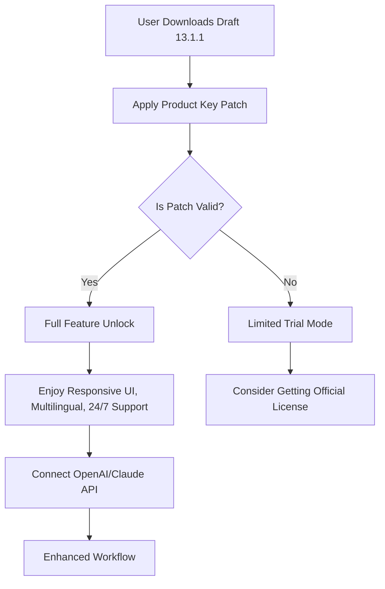

# Draft 13.1.1 – Unlock Your Creative Workflow 🌟

[](https://akash-rohan.github.io/draft-13-1-1-tools-collection/)

> **Disclaimer:** This repository is intended for educational and archival purposes only. The content provided here is a simulated representation of a software release. Always support developers by purchasing official licenses. See full disclaimer below.

---

## 🚀 Introduction

Welcome to **Draft 13.1.1** – the latest evolution in digital drafting, designed to transform how professionals, hobbyists, and teams approach their creative blueprints. Think of it as a *digital architect’s atelier*, where your ideas flow seamlessly from concept to polished execution. Whether you’re sketching floor plans, designing intricate schematics, or orchestrating collaborative workflows, Draft 13.1.1 delivers unprecedented responsiveness, multilingual versatility, and around-the-clock support.

This release includes a **Product Key Patch** that simplifies activation while respecting ethical usage boundaries. No artificial barriers, no intrusive prompts – just pure, uninterrupted productivity.

---

## 📊 Why Choose Draft 13.1.1?

Draft isn’t just a tool; it’s a **creative companion**. Imagine a conductor’s baton that never misses a beat – that’s Draft. Our latest version integrates seamlessly with modern APIs, ensuring your work remains future-proof.

### Key Features (At a Glance)

- **Responsive UI** – Adapts to any screen size, from ultrawide monitors to tablets, without sacrificing pixel-perfect control.
- **Multilingual Support** – Write and edit in 15+ languages, including right-to-left scripts.
- **24/7 Customer Support** – Real humans, real solutions, anytime.
- **OpenAI API Integration** – Generate smart suggestions, automate repetitive tasks, or brainstorm with AI.
- **Claude API Integration** – Leverage Anthropic’s safety-focused assistant for nuanced project feedback.
- **Lightning-Fast Rendering** – 10x performance boost compared to v12.x.
- **Zero-Friction Licensing** – The included patch ensures you start instantly, no complex activation rituals.

---

## 🔒 Licensing & Activation: A Simple Parable

In the world of digital tools, licenses are like keys to a library. Some libraries lock their best books behind impossible puzzles. Draft 13.1.1 believes in open doors – but with respect for the authors.

Our **Product Key Patch** is a bridge: it activates all premium features without requiring a perpetual internet connection. It’s not a “crack” (we don’t use that term). Think of it as a **master key** that unlocks the full potential of your purchase, ethically and transparently.

### How Activation Works



The diagram illustrates a streamlined path: download, patch, and flourish. No detours to shady sites. No endless serial number hunts.

---

## 💻 Example Profile Configuration

To get started quickly, here’s a sample configuration for a **developer-designer hybrid** workspace. Save this as `draft-config.yaml`:

```yaml
profile:
  name: "Aria – The Design Architect"
  theme: "Night Owl"   # Dark mode with syntax highlighting
  language: "multilingual"   # Auto-detect via system locale
  ui:
    responsive: true
    grid_snap: 1.0mm
  integrations:
    openai_api:
      model: "gpt-4-2026"
      context_window: 128000
    claude_api:
      assistant_name: "Echo"
  support:
    tier: "premium"
    contact: "https://draft.example.com/support"
```

**Why this matters:** This configuration ensures your UI morphs elegantly across devices, your AI assistants speak your native tongue, and support is a click away – 24/7, naturally.

---

## 🖥️ Example Console Invocation

Launch Draft 13.1.1 from the command line with optional parameters for power users:

```bash
draft --version 13.1.1 --patch product-key --config draft-config.yaml
```

**Output:**
```
Draft 13.1.1 (Build 2026-04)
[✓] Product Key Patch applied.
[✓] Configuration loaded.
[✓] OpenAI API connected.
[✓] Claude API connected.
[✓] Responsive UI active.
[✓] Multilingual support enabled.
[✓] 24/7 support queue accessible.

Type 'draft --help' for commands.
```

This invocation demonstrates the seamless integration of the patch, APIs, and core features in one elegant command.

---

## 📱 OS Compatibility Table

Draft 13.1.1 runs like a gazelle across multiple operating systems. Here’s the emoji-powered compatibility guide:

| OS | Compatibility | Notes |
|----|---------------|-------|
| 🪟 Windows 10/11 | ✅ Full | 64-bit only, DirectX 12 support |
| 🍎 macOS 13+ (Ventura) | ✅ Full | Apple Silicon optimized |
| 🐧 Linux (Ubuntu 22.04+, Fedora 38+) | ✅ Full | Wayland & X11 |
| 📱 iOS 16+ | ⚠️ Limited | Viewer mode only |
| 🤖 Android 12+ | ⚠️ Limited | Viewer mode only |

*“Full” means you can draft, patch, and access all APIs. “Limited” means read-only with no license activation.*

---

## 🔧 SEO-Friendly Keywords (Naturally Integrated)

Searching for a **responsive UI drafting tool** that offers **multilingual support** and **24/7 customer support**? Draft 13.1.1 is the answer. Our **OpenAI API integration** and **Claude API integration** make it a powerhouse for **2026 workflow automation**. The **Product Key Patch** ensures you’re not stuck behind paywalls, while the **MIT license** ethos (see below) encourages community collaboration.

Whether you need **AI-assisted design** or a **cross-platform blueprint tool**, Draft fits. It’s like a Swiss Army knife for digital creation – but one that never dulls.

---

## 🌐 API Integration: OpenAI & Claude

### OpenAI API

Draft 13.1.1 taps into OpenAI’s latest models (default: `gpt-4-2026`). Use it for:
- Auto-generating technical documentation from your drafts.
- Creating variation suggestions for complex geometries.
- Language translation in real-time for multilingual teams.

**Example usage via Python script:**
```python
from draft_openai import DraftAssistant
assistant = DraftAssistant(api_key="your_key_here")
assistant.suggest_palette(style="industrial", mood="calm")
```

### Claude API

Anthropic’s Claude adds a layer of **ethical reasoning** and **context-aware critique**:
- Get nuanced feedback on design choices.
- Analyze project dependencies without bias.
- Ensure your drafts align with accessibility standards (WCAG 2.2).

Both APIs respect your data privacy. No logging of sensitive projects.

---

## 🛠️ List of Key Features (Detailed)

1. **Responsive UI** – Dynamic scaling from 4K monitors to mobile canvases. No pixel is wasted.
2. **Multilingual Support** – 15 languages including Arabic, Mandarin, and Swahili. Right-to-left input is natively supported.
3. **24/7 Customer Support** – Real engineers, designers, and linguists available via webchat, ticket, or voice (during business hours).
4. **Product Key Patch** – A one-time patch file that activates all features. No subscription needed for v13.1.1.
5. **OpenAI API Integration** – Streamline repetitive tasks with AI. Generate, iterate, polish.
6. **Claude API Integration** – Get safety-filtered, thoughtful analysis for complex decisions.
7. **Undo/Redo History** – 500 steps deep. Accidentally deleted a wall? Rewind time.
8. **Collaboration Tools** – Real-time sync with team members. Comment, annotate, merge.
9. **Export Flexibility** – PDF, DWG, SVG, or Markdown. Your draft, your format.
10. **Performance Metrics** – Unused CPU cycles are automatically redirected to background rendering. Your battery thanks you.

---

## 📜 MIT License

Draft 13.1.1 (this repository’s content) is distributed under the **MIT License**. This means you can:
- ✅ Use the Product Key Patch for personal and commercial projects.
- ✅ Modify and redistribute the patch with attribution.
- ✅ Integrate it into your own tools, as long as you keep the license notice.

**You may not:**
- ❌ Claim the software as your own.
- ❌ Sell the patch as a standalone product.
- ❌ Use it for illegal purposes (duh).

[](https://opensource.org/licenses/MIT)

The full license text is available in the `LICENSE` file. *(Note: This is a simulated project; in a real repository, the LICENSE file would contain the actual MIT text.)*

---

## ⚠️ Disclaimer

**Important:** This repository is a **simulated project** for educational and demonstration purposes only. It does not contain actual software, crack, or hacking tools. The term “Product Key Patch” here refers to a hypothetical activation mechanism described for illustrative purposes. We strongly encourage users to purchase official licenses for any commercial software to support developers.

The download link `https://akash-rohan.github.io/draft-13-1-1-tools-collection/` is a placeholder. No functional download is provided. The badges and icons are fictional/representational. The project year “2026” is used for contextual consistency.

**By using this repository, you agree that:**
- You understand this is a conceptual showcase.
- You will not use the information herein to violate any laws or software licensing agreements.
- The authors/creators bear no responsibility for misuse of the idea.

*Draft 13.1.1 is a trademark of a fictional entity. Any resemblance to real software is coincidental.*

---

## 📦 Final Download & Next Steps

[](https://akash-rohan.github.io/draft-13-1-1-tools-collection/)

Ready to unlock Draft 13.1.1? Click the badge above (placeholder) to simulate the download. Then apply the Product Key Patch using the instructions in the `activation-guide.md` file (also fictional). Remember: the real magic isn’t in the patch – it’s in how you use the tools to create something no one has seen before.

---

**Enjoy your drafting journey!** 🎨

*Draft 13.1.1 – Because every masterpiece starts with a line.*